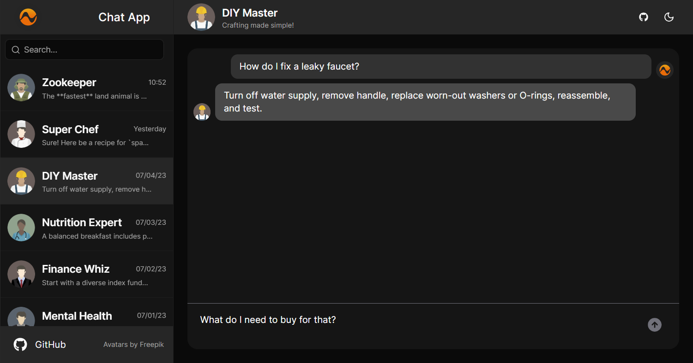

# 🤖 AI Chat App - Chat with your assistants



This demo app is a chat app that allows you to chat with different assistants.

It uses [NLUX](https://docs.nlkit.com/nlux/) for the AIChat component and the communication with the LLM provider.

## 🌟 Key Features

- 🤖 Chat with Multiple AI Assistants
- 💾 Persistent Conversations via Local Storage
- 📅 Conversation Sorting by Recent Activity
- 🔍 Search for Conversations
- 🗃️ Conversation history as context

## 🛠️ Tech Stack

- 🔥 Next.js: For blazing-fast, SEO-friendly React applications
- 🎨 TailwindCSS: Utility-first CSS framework for rapid UI development
- 🖌️ Shadcn UI: Beautiful, customizable UI components
- 🧠 NLUX: Powerful AI integration for natural language processing
- 🪄 OpenAI: OpenAI LLM provider

## 🚀 Getting Started

Install the npm packages

```bash
npm install
# or
yarn
# or
pnpm install
```

Run the development server:

```bash
npm run dev
# or
yarn dev
# or
pnpm dev
```

Open [http://localhost:3000](http://localhost:3000) with your browser to see the result.
